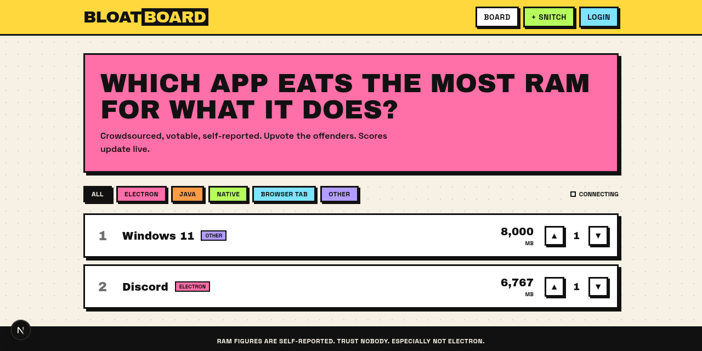
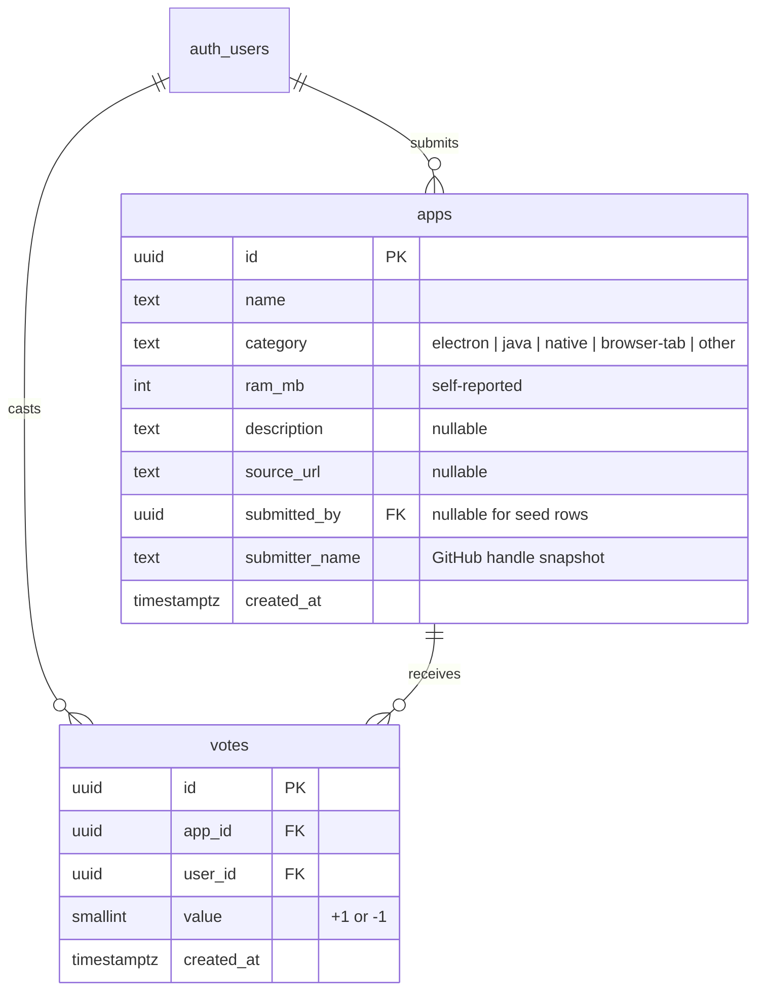

# BloatBoard

A crowdsourced leaderboard of the most RAM-hungry desktop apps. Submit an app with its typical
memory footprint, upvote or downvote what other people submit, and watch the ranking reorder live
across every open tab.

Built for the GCSRM Technical Track (Web Dev, Year 2), Option A: Mini Collaborative App, in the
voting/poll engine category.



## Features

- **Public leaderboard** ranked by community score, with ties broken by RAM footprint.
- **Submit an app** with a category, self-reported RAM usage, optional context and a proof link.
- **Upvote / downvote**, one vote per person per app. Clicking your own arrow again retracts it.
- **Live scores.** Votes cast anywhere update every open tab over a websocket, with no refresh and
  no polling.
- **Filter by category**: Electron, Java, native, browser tab, other.
- **GitHub sign-in.** Browsing is open to everyone; voting and submitting need an account.
- **Edit and delete your own submissions**, enforced in the database rather than just the UI.
- Loading skeletons, empty states, network error handling, and validation on both the client and
  the server.

## Stack

| Layer | Choice |
|---|---|
| Framework | Next.js 16, App Router, React Server Components, Server Actions |
| Database | Supabase Postgres |
| Auth | Supabase Auth with GitHub OAuth, cookie sessions via `@supabase/ssr` |
| Realtime | Supabase Realtime over Postgres logical replication |
| Styling | Tailwind CSS v4, Neobrutalist design language |
| Hosting | Vercel |

## How it works

```
Browser ──server-rendered HTML── Next.js ──PostgREST, user JWT in cookie── Supabase Postgres
   │                                                                            │
   ├── votes: written straight from the client, RLS enforces ownership          │
   └── realtime: websocket subscription on the votes table ◄───────────────────┘
```

Pages are Server Components. They read the session cookie, query the `app_scores` view, and pass
plain data into a small client component. `proxy.ts` refreshes the auth cookie on every request so
the server always sees a valid session.

Submitting, editing and deleting go through Server Actions in `lib/actions.ts`. Validation lives in
`lib/validate.ts` and is mirrored by check constraints in the schema, so a malformed row is rejected
even if it somehow bypasses the form.

Voting is client-side for latency. `VoteButtons.tsx` applies the change optimistically, then upserts
on the `(app_id, user_id)` unique constraint. A failed write rolls the UI back.

Realtime is one channel on the `votes` table. Because the table is set to `replica identity full`,
every insert, update and delete carries both the old and new vote value, so a client can apply
`delta = new - old` to the affected row and re-sort locally without refetching. Your own votes are
skipped by the subscription, since the optimistic update already covered them.

## Data model



`app_scores` is a view over `apps` that adds `score` (the sum of vote values) and `vote_count`. It
is declared `security_invoker`, so row level security on the underlying tables still applies to
anyone reading it. The unique constraint on `(app_id, user_id)` is what guarantees one vote per
person per app.

Full SQL, including policies, lives in [`supabase/schema.sql`](supabase/schema.sql).

## Row level security

| Table | select | insert | update | delete |
|---|---|---|---|---|
| `apps` | anyone | `auth.uid() = submitted_by` | owner only | owner only |
| `votes` | anyone, needed for public scores | `auth.uid() = user_id` | own row | own row |

Ownership is not a UI concern here. The edit action treats "zero rows affected" as "not yours",
because the policy is what decides whether the update lands.

## Running it locally

**1. Create the database**

Make a Supabase project, open the SQL editor, and run [`supabase/schema.sql`](supabase/schema.sql).
That creates the tables, the view, the policies and the realtime publication. Optionally run
[`supabase/seed.sql`](supabase/seed.sql) to start with some obvious offenders on the board.

**2. Set up GitHub OAuth**

Register an OAuth app at https://github.com/settings/developers with the callback URL pointing at
Supabase, not at your app:

```
https://<your-project-ref>.supabase.co/auth/v1/callback
```

Then in the Supabase dashboard under Authentication → Providers, enable GitHub and paste in the
client ID and secret. Under Authentication → URL Configuration, set the site URL to
`http://localhost:3000` and add `http://localhost:3000/**` to the redirect allow-list. Add your
production URL the same way when you deploy.

**3. Configure the app**

```bash
cp .env.example .env.local
```

Fill in the two values from Project Settings in the Supabase dashboard. The URL is the bare project
URL with no path suffix, and the key is the anon or publishable key, never the service role key.

```
NEXT_PUBLIC_SUPABASE_URL=https://<your-project-ref>.supabase.co
NEXT_PUBLIC_SUPABASE_ANON_KEY=<anon key>
```

**4. Run**

```bash
npm install
npm run dev
```

## Scripts

| Command | What it does |
|---|---|
| `npm run dev` | Development server on port 3000 |
| `npm run build` | Production build |
| `npm start` | Serve the production build |
| `npm run lint` | ESLint |
| `npm test` | Form validation self-check |

## Deploying

Import the repository on Vercel and set `NEXT_PUBLIC_SUPABASE_URL` and
`NEXT_PUBLIC_SUPABASE_ANON_KEY` in the project's environment variables. Both are safe to expose to
the browser, since row level security is what protects the data. After the first deploy, add the
production `/auth/callback` URL to Supabase's redirect allow-list.

## Project layout

```
app/
  page.tsx              leaderboard
  submit/               submission form
  app/[id]/             detail view
  app/[id]/edit/        owner-only edit form
  login/                GitHub sign-in
  profile/              your submissions
  auth/callback/        OAuth code exchange
components/             Header, LeaderboardTable, VoteButtons, AppDetail, SubmitForm,
                        CategoryFilter, Skeletons, DeleteButton, GitHubButton
lib/
  supabaseClient.ts     browser client
  supabaseServer.ts     cookie-aware server client
  queries.ts            read paths
  actions.ts            Server Actions for write paths
  validate.ts           shared validation, with a test alongside it
  realtime.ts           vote subscription and delta logic
  types.ts              shared types, categories and colours
supabase/
  schema.sql            tables, view, RLS policies, realtime setup
  seed.sql              starter data
proxy.ts                session cookie refresh
```

## Not in v1

Comments and threads, verified RAM measurement (everything here is self-reported and labelled as
such), and admin moderation tooling.

## License

Apache License 2.0. See [LICENSE](LICENSE).
